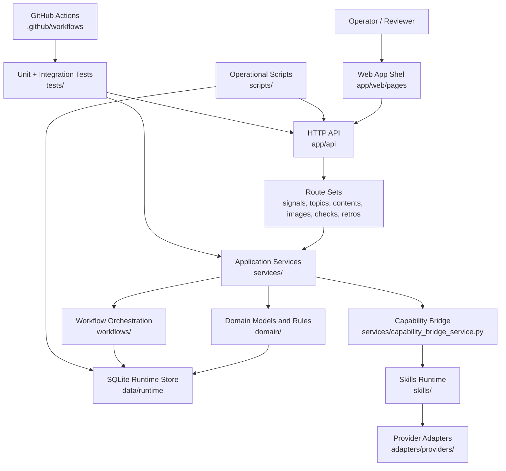

# Traffic Factory v2


Traffic Factory V2 is an open-source, local-first AI workflow infrastructure
project for content operations, workflow orchestration, and agent-assisted
publishing.

It helps maintainers and operators transform raw signals into auditable content
packages through deterministic workflow gates, explicit domain boundaries,
SQLite-backed records, and testable service modules.

The current baseline focuses on a strict phase-one workflow:

```text
Signal -> Topic -> Content Variant -> Image Asset -> Publish Check -> Retro Record
```

The project is designed for maintainability, reproducibility, release
readiness, and future multi-agent maintainer automation.

Project scope: open-source, local-first, AI workflow infrastructure, content
operations, workflow orchestration, agent-assisted publishing, maintainer
automation, and release workflows.

## Why This Project Matters

Modern content operations often depend on scattered prompts, manual review,
temporary files, and undocumented handoffs.

Traffic Factory V2 turns that process into a reproducible workflow with
explicit states, persistent records, hard publish gates, and auditable
transitions.

The project is intentionally local-first so contributors can run, inspect,
test, and improve the workflow without requiring production infrastructure.

This makes it suitable for experimentation with AI-assisted maintainer
workflows, release checks, content quality gates, and future multi-agent
operations.

## Current Status

The phase-one delivery line is complete and is now in cleanup and release
hardening. The current target is a deliverable baseline where the core workflow,
runtime entrypoint, smoke checks, release checks, and rollback documentation are
all reviewable.

The matching domain model is:

```text
Signal -> Topic -> ContentVariant -> ImageAsset -> PublishCheck -> RetroRecord
```

## Architecture



## Core Invariants

1. A topic cannot be created without a signal.
2. A content variant cannot be created without a topic.
3. An image asset cannot be created without a content variant.
4. A retro record cannot be created without a publish check.
5. The main workflow cannot skip steps.
6. Every main-chain object must be persisted.
7. Publish checks are hard gates, not advisory hints.
8. When a content variant or image asset changes, the old publish check is
   invalidated and a new publish check must be created.

Publish check results are fixed to:

```text
PASS / WARN / BLOCK
```

## Repository Map

- `app/api/`: minimal API entrypoint and route sets.
- `app/web/pages/`: web page shells and browser-facing workflow actions.
- `app/web/action_bridge.py`: bridge from page actions to API calls.
- `domain/`: domain objects, invariants, status rules, and persistence-facing
  contracts.
- `services/`: application services for the main chain, checks, and capability
  orchestration.
- `workflows/`: main-chain workflow orchestration.
- `skills/` and `adapters/providers/`: minimal skill runtime and provider
  adapter skeletons.
- `scripts/`: database initialization, restart, smoke, and release-check tools.
- `tests/`: unit and integration coverage for the workflow, API, runtime, and
  release gates.
- `docs/`: source-of-truth documentation for boundaries, operations, release
  checks, and known limits.
- `stitch/`: design input assets only; it is not the runtime web directory.

## Source Of Truth

Start with these documents when reviewing scope or behavior:

1. `docs/phase1-minimal-system-definition.md`
2. `docs/phase1-implementation-plan.md`
3. `docs/repo-boundaries.md`
4. `docs/current-main-operations.md`
5. `docs/release-checklist.md`
6. `docs/current-main-known-limits.md`

## Requirements

The project requires Python 3.11 or newer. The preferred local interpreter is
the repository virtual environment:

```bash
.venv/bin/python --version
```

Avoid relying on the system `python3` on macOS, where it may point to Python
3.9.

## Common Commands

Initialize the default SQLite database:

```bash
.venv/bin/python scripts/init_db.py
```

Run the full test suite:

```bash
.venv/bin/python -m unittest discover -s tests -p "test_*.py"
```

Start the current main runtime directly:

```bash
.venv/bin/python -m app.main \
  --host 127.0.0.1 \
  --port 8787 \
  --db-path data/runtime/traffic_factory.sqlite3
```

Start with explicit logging:

```bash
.venv/bin/python -m app.main \
  --host 127.0.0.1 \
  --port 8787 \
  --db-path data/runtime/traffic_factory.sqlite3 \
  --log-level INFO \
  --no-access-log
```

## Restart Runbook

Use the restart script for the current main runtime:

```bash
bash scripts/restart_current_main.sh
```

The script:

1. Selects the active virtual environment, then `.venv/bin/python`, then
   `python3.11`.
2. Fails fast if the interpreter is older than Python 3.11.
3. Validates `TF_PORT` and checks whether `TF_HOST:TF_PORT` is already in use.
4. Creates the database directory, runs `scripts/init_db.py`, and starts
   `app.main` with the same interpreter.
5. Supports `TF_PYTHON`, `TF_HOST`, `TF_PORT`, `TF_DB_PATH`, `TF_LOG_LEVEL`,
   and `TF_ACCESS_LOG`.

Example:

```bash
TF_PORT=8788 \
TF_DB_PATH=data/runtime/traffic_factory.sqlite3 \
bash scripts/restart_current_main.sh
```

Enable access logs explicitly:

```bash
TF_PORT=8788 \
TF_LOG_LEVEL=DEBUG \
TF_ACCESS_LOG=true \
bash scripts/restart_current_main.sh
```

## Health Checks

After startup, run the smoke test:

```bash
.venv/bin/python scripts/current_main_smoke_test.py \
  --base-url http://127.0.0.1:8787
```

If the current instance runs on port `8791`:

```bash
.venv/bin/python scripts/current_main_smoke_test.py \
  --base-url http://127.0.0.1:8791
```

Success criteria:

1. `/healthz` returns HTTP 200 and `ok=true`.
2. `/readyz` returns HTTP 200 and `ok=true`.
3. `/discovery` returns HTTP 200.
4. `/api/signals` returns HTTP 200 and `ok=true`.
5. `/api/topics` returns HTTP 200 and `ok=true`.
6. The script exits with code 0.

If the smoke test fails, inspect port usage, database paths, and runtime logs
before stopping a healthy existing instance.

## Release Gates

Automated release rehearsal:

```bash
mkdir -p logs
TF_PORT=8790 \
TF_DB_PATH=data/runtime/traffic_factory_staging.sqlite3 \
bash scripts/restart_current_main.sh > logs/current-main.log 2>&1 &
```

```bash
.venv/bin/python scripts/release_check.py \
  --env-file deploy/staging.env.example \
  --base-url http://127.0.0.1:8790 \
  --startup-log logs/current-main.log
```

Minimal CI and pre-release gate:

- `.github/workflows/current-main-gate.yml`
- Pull requests and pushes to `main` run the unittest suite.
- `workflow_dispatch` can run a current-main release rehearsal.

## AI-assisted Maintenance

Traffic Factory V2 is structured to support AI-assisted maintenance workflows.

Potential maintainer automation areas include:

- Pull request review for workflow invariants and boundary violations
- Issue triage for reproducible bugs and documentation gaps
- Release checklist validation
- Security review for workflow gate bypass, unsafe provider adapters, and
  secret leakage
- Documentation updates when runtime behavior changes
- Test generation for service, workflow, API, and release-gate coverage

Codex or other coding agents should follow the repository boundaries, preserve
the fixed main workflow, and run the validation commands before proposing
changes.

## For Codex and Coding Agents

Before making changes, coding agents should read:

- `AGENTS.md`
- `CONTRIBUTING.md`
- `docs/repo-boundaries.md`
- `docs/release-checklist.md`
- `docs/current-main-known-limits.md`

Agent-generated changes should preserve workflow invariants, avoid unrelated
refactors, and include validation results in the pull request.

## Roadmap

### v2: Stabilize The Local Delivery Baseline

- Keep the strict main-chain workflow stable from signal intake to retro record.
- Harden the current runtime entrypoint, restart script, smoke checks, and
  release checks.
- Improve the web app shell so operators can complete the workflow without
  jumping between implementation details.
- Expand evidence capture for publish checks, invalidation behavior, and retro
  records.
- Keep SQLite as the default local store while preserving clear repository and
  service boundaries.
- Maintain a small, reviewable CI gate for unit, integration, and release
  rehearsal checks.
- Produce English project-facing documentation for external review and GitHub
  visibility.

### v3: Expand Into A Multi-Source Content Operations Platform

- Add richer source ingestion with configurable providers, schedules, and
  source health signals.
- Introduce scoring and prioritization for signals, topics, and content
  candidates.
- Extend provider adapters for content generation, image generation, and
  publishing-support workflows.
- Add operator dashboards for pipeline status, quality gates, exceptions, and
  historical performance.
- Support team-level governance: role boundaries, approvals, audit trails, and
  release evidence bundles.
- Prepare deployment profiles beyond the local runtime, while keeping local
  development reproducible.
- Add analytics loops so retro records can feed future source selection,
  scoring, and content planning.

## Repository Governance

The repository is maintained around a small set of explicit rules:

- The phase-one workflow must remain stable and auditable.
- Main-chain objects must be persisted before downstream steps use them.
- Publish checks are hard gates.
- Runtime outputs must stay outside version control.
- Documentation should be updated when behavior or operations change.
- Pull requests should include validation evidence.

## Contributing

Contributions are welcome when they preserve the fixed workflow, remain small
enough to review, and include validation evidence.

Before opening a pull request, please read:

- `CONTRIBUTING.md`
- `.github/pull_request_template.md`
- `AGENTS.md`

## Security

Please do not report security vulnerabilities through public GitHub issues.

Security-sensitive areas include workflow gate bypass, publish check bypass,
SQLite persistence corruption, unsafe provider adapter behavior, secret
leakage, runtime data exposure, and CI or release-check bypass.

See `SECURITY.md` for responsible disclosure guidance.

## Further Reading

- Current main operations: `docs/current-main-operations.md`
- Release checklist: `docs/release-checklist.md`
- Known limits: `docs/current-main-known-limits.md`
- Repository boundaries: `docs/repo-boundaries.md`
- Documentation index: `docs/README.md`
- Contributing guide: `CONTRIBUTING.md`
- Security policy: `SECURITY.md`
- Codex project instructions: `AGENTS.md`
